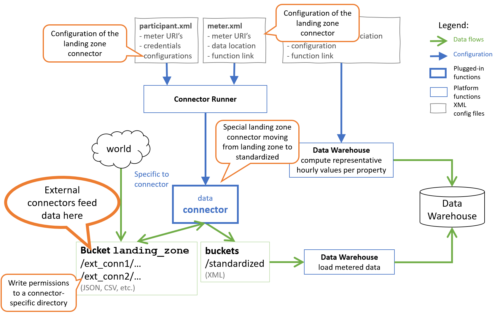

API
===

Data Upload API
---------------

Platform participants can upload their data using GCP cloud storage REST API. Data uploads are done to the special bucket called 'landing_zone'.
Every hour a special internal landing zone connector is invoked that is pulling the new files from the landing zone and moving them into the standardized location.
This internal landing zone connector is made to ensure that the third parties are isolated from the main data flow, and that the incoming files are checked prior to being accepted by the platform.

The data flow for external connector is a variaton of the main data flow, as depicted in the figure below.

   Data flow for external connectors

The data is pushed onto the `landing_zone` bucket by the external connectors, and this data becomes raw data for the system. Then the internal landing zone connector is 
invoked given the configuration from the `properties.xml` files and is moving that data to 'standardized'. The data is linked to the meters that are described with their XML configuration files, same as all other meters.  

The `landing_zone` bucket is subject to GCP conditional permissions:

+ each external connector is provided with a special service account
+ a separate directory is created in the `landing_zone` bucket with conditional permissions granting this service account write access
+ the service account is only granted permissions `Storage Object Creator` and `Storage Object Viewer`, without the object listing permissions. That is done because object listing permissions are defined for the whole bucket, and granting a connector permission to list objects would also allow listing objects that belong to other external connectors.   

The permissions are GCP conditional, limited to each external connector's specific directory (file name prefix in GCP storage bucket terms). For example, external connector `ext_conn1` would be granted permissions

.. code-block:: javascript
  
  resource.name.startsWith('projects/_/buckets/landing_zone/objects/ext_conn1')

Accordingly, the external connectors can write a file, read that file knowing file name, but not list the uploaded files.

Data Download API
-----------------

Platform participants can download their data using GCP cloud storage REST API and their login credentials to the platform. 
If needed, service account credentials may be generated using GCP means to allows depersonalized data access. 
 
Recorded data of a meter may be accessed with an HTTP call to a specific file in a specific bucket at URL `/b/BUCKET/o/OBJECT`, for example: 
`/b/participant_1/coned/standardized/3/2021-11-08T14:00:00`
that will refer to standardized readings of meter number 3 made on November 8, 2021, at 2 p.m. by a ConEd connector, operated by participant number 1 of a consortium. 

Uploading data this way should be avoided because it will intervene with internal data processing flows. Uploading to a landing zone should be used instead, as described above.
