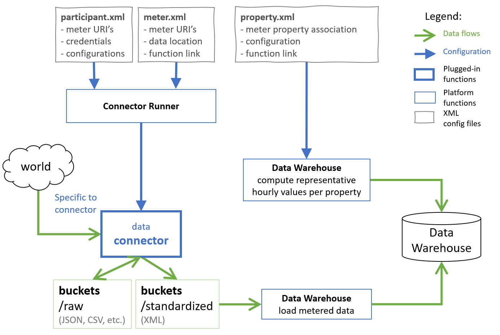

Architecture
============

.. index:: Architecture

The platform is designed as a cloud-native serverless solution built for Google Cloud Platform (GCP), 
relying on Cloud Functions for its computing needs, on Cloud Storage buckets for all storage, and on BigQuery for combining collected data for analytics.

The platform serves several participating organizations called platform participants. 
For each participant a special user group is created in Google Admin, holding users related to this participant. 
Configuration and data of each participant is stored in a separate GCP cloud storage bucket,
with its access restricted to platform core functions and the corresponding user group. 

The platform is activated by a dispatcher, called hourly. The dispatcher is a cloud function that checks each participant, 
reads participants' configurations, and invokes the necessary connectors to fetch meter data.

The connectors are also implemented as cloud functions that are invoked to fetch data for specific meters, configured by specific participants. 
The connectors are producing hourly data for each meter, keeping a log of raw data as fetched from the meter, 
and performing all actions necessary to fetch, convert, aggregate or interpret the raw data to obtain per-hour meter readings that are also referred to as 'standardized' data.

Then the standardized hourly data is further aggregated per type of data to form the final hourly measurements of each type of data that are loaded into the data warehouse. 
In a typical example, several occupancy censors would be installed in a building, each processed by a separate connector call, collecting data for each sensor.
Then these per-sensor meter readings would be aggregated to estimate the total building occupancy at each hour.

.. figure:: top-level-architecture.png
   :width: 100%

   Architecture overview of the system
 
Connectors
---------- 

.. index:: Connectors

Platform data connectors are internal to the platform, implemented and deployed as cloud functions.
All connectors are configured with XML files stored on GCP cloud storage buckets of the appropriate platform participants. 
The platform dispatcher is parsing these configurations to determine which cloud functions need to be invoked and with which parameters. 

External connectors are not deployed with the platform, but are deployed externally and send standardized data directly to the GCP cloud storage buckets using the GCP cloud storage REST API. 
They are not invoked by the shared core, and they are not configured in XML as invokable cloud functions.
They may provide their data at arbitrary moments, 'pushing' them to the platform. 

Data Warehouse
--------------

Metered data is put into a broader context for analytics, given:

+ type of metered data: as property electricity consumption, property occupancy, expected CO2 emissions given the type of electricity supply contract, weather conditions such as temperature
+ regional information about office hours, holidays, office closures, etc.
+ derived metrics, such as the difference between the internal building temperature and the outside temperature, that has to be achieved. 

Meters and their association to specific properties is configured in XML for both, internal and external connectors. 

.. index:: Data Flows

Both, configuration data and metered data, is loaded into the data warehouse as illustrated with the following figure:

   Data and configuration flow

All this data is then analyzed with Google Data Studio to formulate and assess various energy benchmarking formulas.
