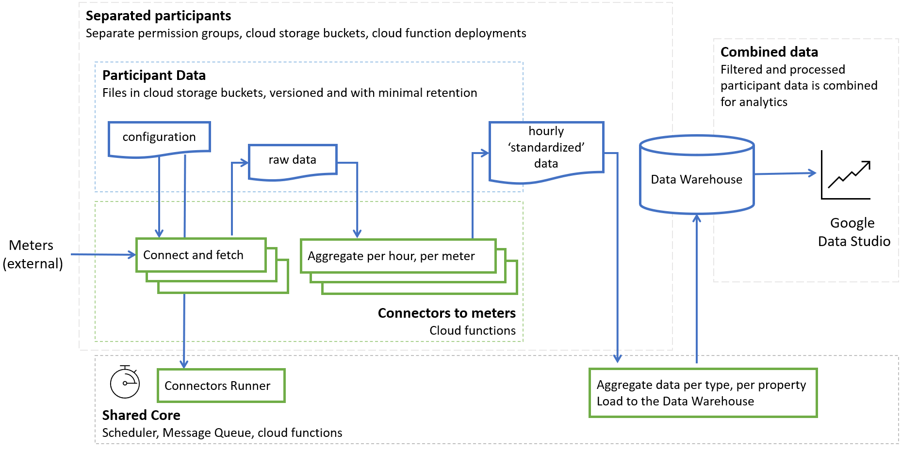

Architecture
============

The system is built to orchestrate connectors (implemented as cloud functions) _
to fetch data from external meters attached to various properties and measuring data of different kinds: electricity, occupancy, ambient temperature, etc. _
Then this data is aggregated to construct a per-property per-hour per-data-kind cleansed records that are collected across properties for analytics:

   Architecture overview of the system
 
Shared Core
-----------

Connectors
---------- 

Data Warehouse
--------------