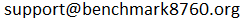

Benchmark 8760 Platform
=======================

**The Benchmark 8760 Platform** is an open-source solution for collecting hourly energy performance data from commercial buildings, and aggregating them for analytics.

The solution is deployed at the `Benchmark 8760 Proof of Concept Portal <https://benchmark8760.org/>`_, 
collecting and visualizing real-time data for several participants.

This document is aimed at engineers willing to join the Portal and develop connectors to provide data. 
It is best read together with the general Platform Technical Documentation located `here <https://benchmark8760.org/Benchmark%208760%20Platform%20Technical%20Documentation.pdf>`_. 

Contents
--------

.. toctree::
	:maxdepth: 2

	architecture
	data
	api

Contact Benchmark 8760 Platform Support at |email| to obtain:

+ access credentials, 
+ actual endpoint URL's, 
+ meter URI's, and
+ all other practicalities. 

